# Laporan Proyek Machine Learning
### Nama : Andhika satria firmansyah
### Nim : 211351154
### Kelas : Pagi A

## Domain proyek ( Iris species )


Kumpulan data bunga Iris atau kumpulan data Iris Fisher adalah kumpulan data multivariat yang digunakan dan dipopulerkan oleh ahli statistik dan biologi Inggris Ronald Fisher dalam makalahnya tahun 1936 Penggunaan beberapa pengukuran dalam masalah taksonomi sebagai contoh analisis diskriminan linier. Kadang-kadang disebut kumpulan data Iris Anderson karena Edgar Anderson mengumpulkan data untuk mengukur variasi morfologi bunga Iris dari tiga spesies terkait. Dua dari tiga spesies dikumpulkan di Semenanjung Gaspé "semuanya dari padang rumput yang sama, dan dipetik pada hari yang sama serta diukur pada waktu yang sama oleh orang yang sama dengan peralatan yang sama"

Kumpulan data terdiri dari 50 sampel dari masing-masing tiga spesies Iris (Iris setosa, Iris virginica dan Iris versicolor). Empat ciri diukur dari setiap sampel: panjang dan lebar sepal dan kelopak, dalam sentimeter. Berdasarkan kombinasi keempat ciri tersebut, Fisher mengembangkan model diskriminan linier untuk membedakan spesies satu sama lain. Makalah Fisher diterbitkan dalam Annals of Eugenics.

## Business understanding

### Problem statements
Karena saya mempunyai pengukuran yang saya tahu spesies iris yang benar, ini adalah masalah pembelajaran yang diawasi. Saya ingin memprediksi salah satu dari beberapa pilihan (spesies iris), menjadikannya contoh masalah klasifikasi. Keluaran yang mungkin (spesies iris yang berbeda) disebut kelas. Setiap iris dalam kumpulan data termasuk dalam salah satu dari tiga kelas yang dipertimbangkan dalam model, jadi masalah ini adalah masalah klasifikasi tiga kelas. Keluaran yang diinginkan untuk satu titik data (sebuah iris) adalah spesies bunga dengan mempertimbangkan fitur-fiturnya. Untuk suatu titik data tertentu, kelas/spesies yang dimilikinya disebut labelnya.

### Goals
Beberapa iris yang sebelumnya telah diidentifikasi oleh ahli botani sebagai spesies setosa, versicolor, atau virginica. Dengan pengukuran ini, dia bisa yakin spesies mana yang dimiliki masing-masing iris. Saya akan mempertimbangkan bahwa ini adalah satu-satunya spesies yang akan ditemui ahli botani.
Tujuannya adalah untuk membuat model pembelajaran mesin yang dapat belajar dari pengukuran iris yang spesiesnya sudah diketahui, sehingga kita dapat memprediksi spesies iris baru yang ditemukan.

### Solution statements
- ​Menggunakan Algoritma K-Means untuk memprediksi jenis Iris berdasarkan data species, seperti Iris Setosa, Iris Virginica, dan Iris Versicolor.

- Sistem berjalan dengan menggunakan metode K Means yang dinilai cocok untuk melakukan segmentasi atau clustering.

- Akurasi adalah ukuran seberapa sering model memprediksi dengan benar.

### Data understanding
Untuk membuat aplikasi Iris species,saya menggunakan dataset "Iris species", dataset ini berisi tentang jenis bunga Iris.
[Iris Species](https://www.kaggle.com/datasets/uciml/iris)  

### Variabel-variabel yang terdapat pada Dataset adalah sebagai berikut:

| No | Nama Variable    |           Keterangan               |
|----|------------------|------------------------------------|
| 1  | Sepal length     |           Panjang sepal            |
| 2  | Sepal width      |           Lebar sepal              |
| 3  | Petal length     |           Panjang kelopak          |
| 4  | Petal width      |           Lebar kelopak            |
| 5  | Species          |           Spesies Iris             |

## Exploratory Data Analyst (EDA)

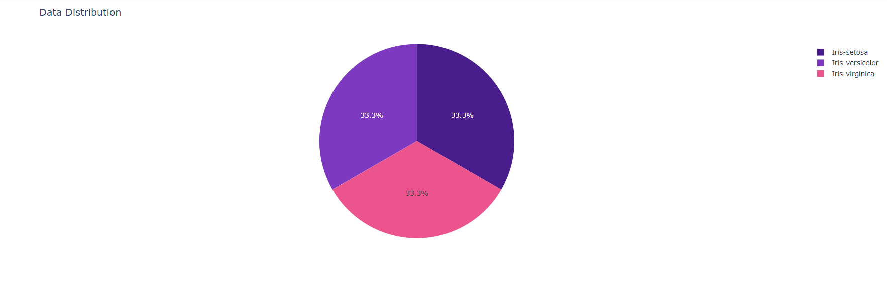

Datanya sangat seimbang

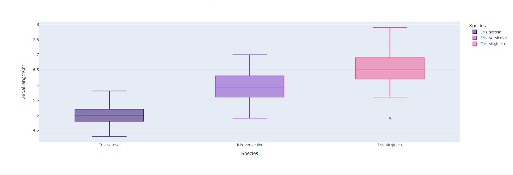

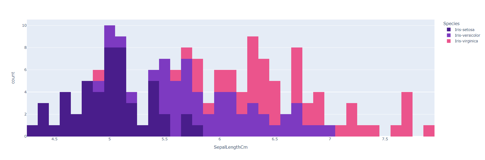

Setosa memiliki SepalLength yang jauh lebih kecil dibandingkan 2 kelas lainnya

Virginca memiliki SepalLength tertinggi, namun tampaknya sulit membedakan antara Virginca dan Versicolor menggunakan SepalLength karena perbedaannya kurang jelas

Kita dapat melihat bahwa Virginia mengandung outlier

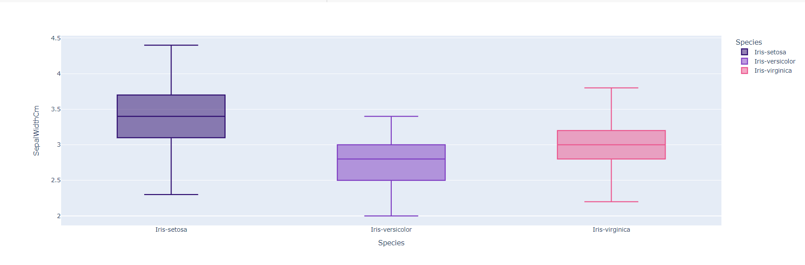

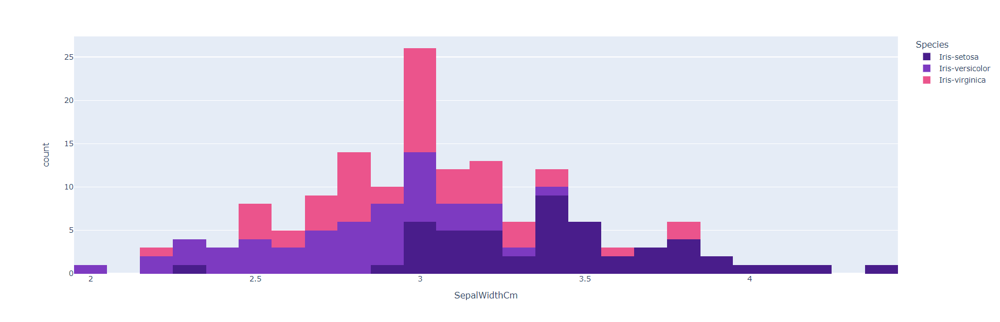

Setosa memiliki SepalWidth yang lebih besar dibandingkan 2 kelas lainnya

Versicolo memiliki SepalWidth yang lebih kecil dibandingkan 2 kelas lainnya

Secara keseluruhan semua kelas tampaknya memiliki nilai sepalwidth yang relatif dekat yang menunjukkan bahwa ini mungkin bukan fitur yang sangat berguna

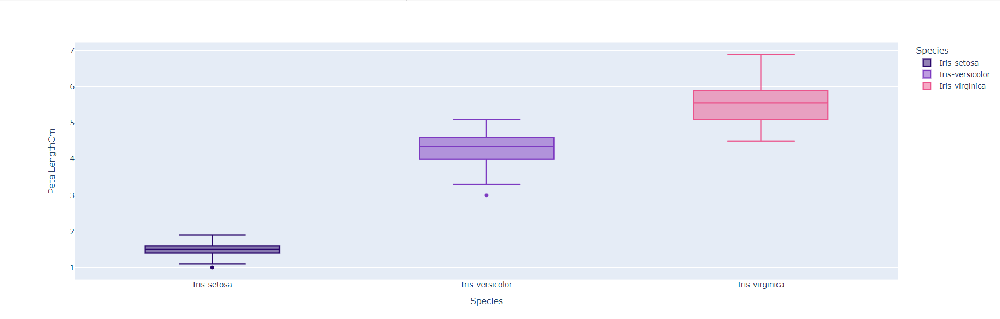

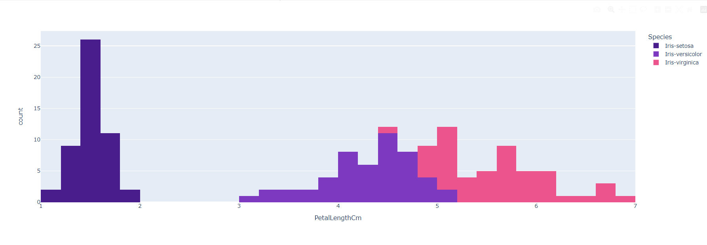

Setosa memiliki PetaLength yang jauh lebih kecil dibandingkan 2 kelas lainnya

Perbedaan ini kurang jelas antara Virginica dan Versicolor

Secara keseluruhan, ini sepertinya fitur PetaLength yang menarik

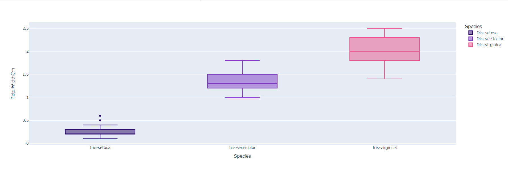

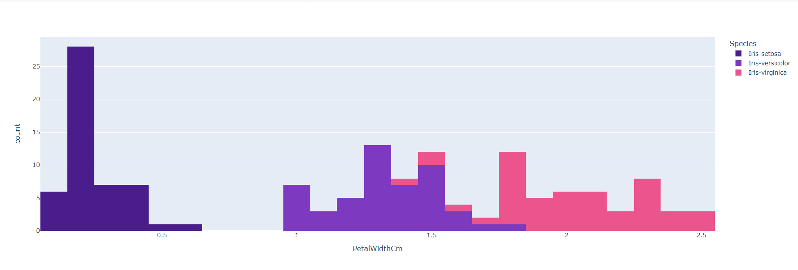

Setosa memiliki PetalWidth yang jauh lebih kecil dibandingkan 2 kelas lainnya

Perbedaan ini kurang jelas antara Virginica dan Versicolor

Secara keseluruhan, ini sepertinya fitur PetalWidth yang menarik

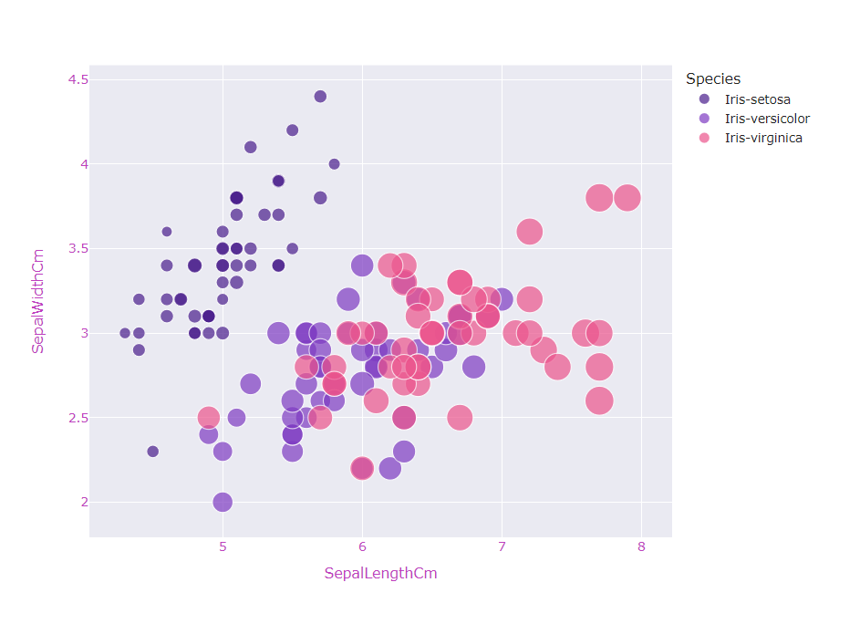

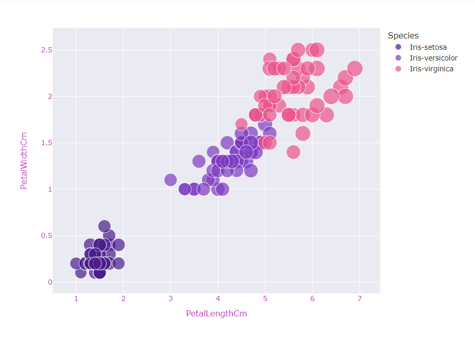

### Data preparation

```bash
from google.colab import files
files.upload()
```

```bash
# make directory and change permission
!mkdir -p ~/.kaggle
!cp kaggle.json ~/.kaggle/
!chmod 600 ~/.kaggle/kaggle.json
!ls ~/.kaggle
```

```bash
!kaggle datasets download -d uciml/iris
```

```bash
!unzip iris.zip -d iris1
!ls iris1
```

Import semua library yang dibutuhkan

```bash
import numpy as np
import pandas as pd
import plotly.express as px
import seaborn as sns
import plotly.graph_objects as go
from sklearn.preprocessing import MinMaxScaler
from sklearn.cluster import KMeans
```

Setelah itu kita akan men-definsikan dataset menggunakan fungsi pada library pandas

```bash
iris = pd.read_csv("/content/iris1/Iris.csv")
iris.drop('Id',inplace=True,axis=1)
```

### Data discovery

Lalu kita akan melihat informasi mengenai dataset seperti dibawah:

```bash
X = iris.iloc[:,:-1].values

y = iris.iloc[:,-1].values
```

```bash
iris.head().style.background_gradient(cmap =sns.cubehelix_palette(as_cmap=True))
```
Dengan hasil sebagai berikut:

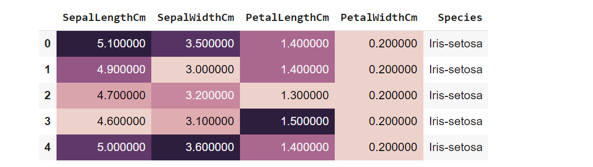

```bash
iris = iris.drop('PetalWidthCm', axis = 1)
```

```bash
iris.head().style.background_gradient(cmap = 'RdPu').set_properties(**{'font-family': 'Segoe UI'}).hide_index()
```

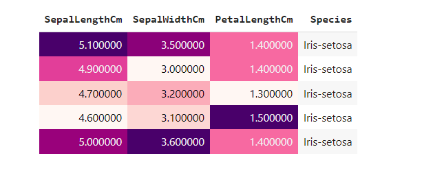

### Modeling

Menggunakan metode elbow untuk mencari jumlah cluster yang optimal untuk k-means clustering

```bash
sse = []
for i in range(1,9):
    kmeans = KMeans(n_clusters=i , max_iter=300)
    kmeans.fit(X)
    sse.append(kmeans.inertia_)

fig = px.line(y=sse,template="seaborn",title='Eblow Method')
fig.update_layout(width=800, height=600,
title_font_color="#BF40BF",
xaxis=dict(color="#BF40BF",title="Clusters"),
yaxis=dict(color="#BF40BF",title="SSE"))
```

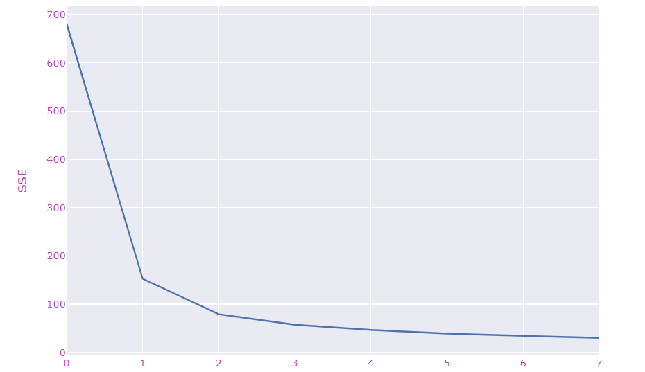

Seperti yang diharapkan, jumlah cluster yang optimal tampaknya adalah 3 jadi mari kita implementasi model menggunakan 3 cluster

```bash
kmeans = KMeans(n_clusters = 3, init = 'k-means++', max_iter = 300, n_init = 10, random_state = 0)
clusters = kmeans.fit_predict(X)
```

### Visualisasi hasil modeling

Sekarang mari kita visualisasikan hasil

```bash
fig = go.Figure()
fig.add_trace(go.Scatter(
    x=X[clusters == 0, 0], y=X[clusters == 0, 1],
    mode='markers',marker_color='#DB4CB2',name='Iris-setosa'
))

fig.add_trace(go.Scatter(
    x=X[clusters == 1, 0], y=X[clusters == 1, 1],
    mode='markers',marker_color='#c9e9f6',name='Iris-versicolour'
))

fig.add_trace(go.Scatter(
    x=X[clusters == 2, 0], y=X[clusters == 2, 1],
    mode='markers',marker_color='#7D3AC1',name='Iris-virginica'
))

fig.add_trace(go.Scatter(
    x=kmeans.cluster_centers_[:, 0], y= kmeans.cluster_centers_[:,1],
    mode='markers',marker_color='#CAC9CD',marker_symbol=4,marker_size=13,name='Centroids'
))
fig.update_layout(template='plotly_dark',width=1000, height=500,title='Kmean Clustering Results')
```
Sebagai contoh, kita akan melihat salah satu contoh hasil dari model clustering kita, hasil clustering pun akan membuat kolom baru dalam data x, yaitu kolom label yang memuat label/hasi cluster dari masing-masing data, kita akan melihat hasil clustering.

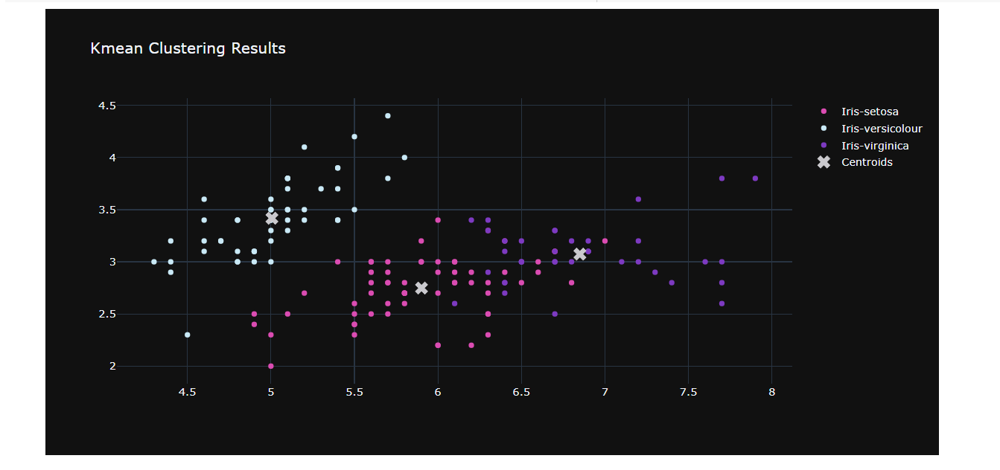

Secara sederhana, kita mendapatkan 3 segmentasi species iris

### Simpan model pickle

```bash
iris.to_excel("iris.xlsx")
```

### Deployment
[Iris prediction](https://irisspecies-m3qkrun8dxfn8mcfqs9hym.streamlit.app/)

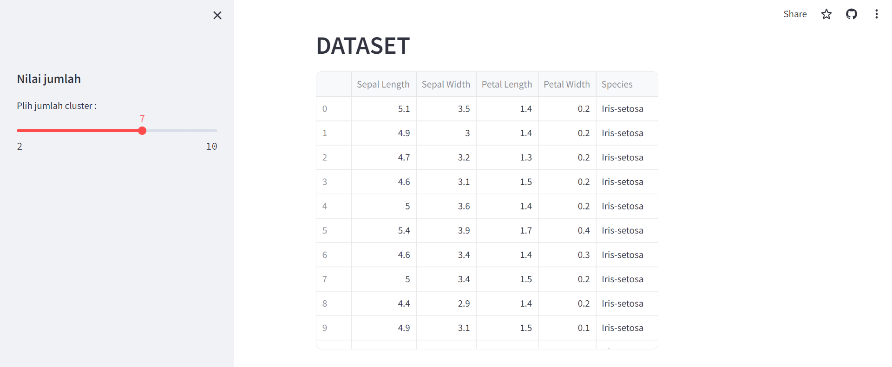
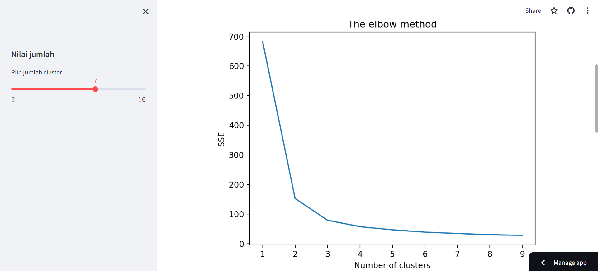
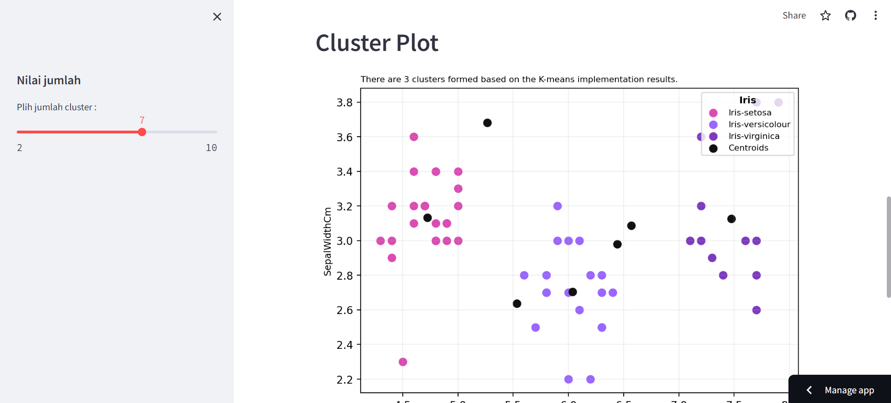
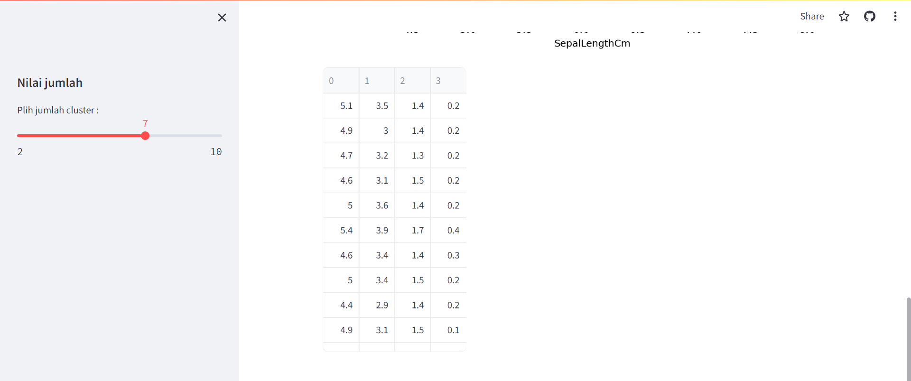
